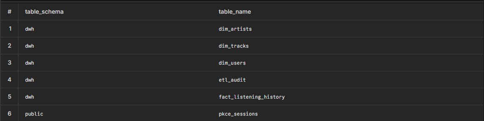

# DDL y Migraciones — Mi Spotify Wrapped

## Qué se configuró / implementó

Se desplegó un **star schema** en PostgreSQL (Neon) bajo el schema `dwh`, con **6 tablas** en total:

| Tabla | Schema | Rol |
|-------|--------|-----|
| `dim_users` | `dwh` | Dimensión — perfil y tokens OAuth del usuario |
| `dim_artists` | `dwh` | Dimensión — top artistas (`genres` como `TEXT[]`) |
| `dim_tracks` | `dwh` | Dimensión — top tracks y tracks del historial |
| `fact_listening_history` | `dwh` | Hechos — una fila por reproducción (`user_id` + `played_at`) |
| `etl_audit` | `dwh` | Auditoría — cada ejecución del pipeline ETL |
| `pkce_sessions` | `public` | Operacional — estado temporal del flujo OAuth PKCE |

Las migraciones se gestionan con **Alembic** (`backend/alembic/`). La URL de conexión se lee desde `DATABASE_URL` en el `.env` vía `app/core/config.py` → `alembic/env.py`.

> **Grain de la tabla de hechos:** `fact_listening_history` = una reproducción por usuario en un instante `played_at`. La unicidad se garantiza con `UNIQUE (user_id, played_at)`.

---

## Script DDL completo

Script de referencia equivalente al modelo usado por la API y el ETL. En producción se aplica con Alembic, no de forma manual salvo entornos locales de prueba.

```sql
-- ---------------------------------------------------------------------------
-- Schema
-- ---------------------------------------------------------------------------
CREATE SCHEMA IF NOT EXISTS dwh;

-- ---------------------------------------------------------------------------
-- OAuth PKCE (tabla operacional, fuera del star schema)
-- ---------------------------------------------------------------------------
CREATE TABLE public.pkce_sessions (
    state      VARCHAR(128) PRIMARY KEY,
    verifier   TEXT NOT NULL,
    created_at TIMESTAMP DEFAULT CURRENT_TIMESTAMP
);

-- ---------------------------------------------------------------------------
-- Dimensiones
-- ---------------------------------------------------------------------------
CREATE TABLE dwh.dim_users (
    user_id               SERIAL PRIMARY KEY,
    spotify_id            VARCHAR(100) UNIQUE NOT NULL,
    display_name          VARCHAR(255),
    email                 VARCHAR(255),
    country               VARCHAR(10),
    followers             INT,
    product               VARCHAR(20),
    spotify_access_token  TEXT,
    spotify_refresh_token TEXT,
    token_expires_at      TIMESTAMP,
    loaded_at             TIMESTAMP DEFAULT CURRENT_TIMESTAMP
);

CREATE TABLE dwh.dim_artists (
    artist_id       SERIAL PRIMARY KEY,
    spotify_id      VARCHAR(100) UNIQUE NOT NULL,
    name            VARCHAR(255) NOT NULL,
    popularity      INT,
    followers_count INT,
    genres          TEXT[],
    loaded_at       TIMESTAMP DEFAULT CURRENT_TIMESTAMP
);

CREATE TABLE dwh.dim_tracks (
    track_id     SERIAL PRIMARY KEY,
    spotify_id   VARCHAR(100) UNIQUE NOT NULL,
    name         VARCHAR(255) NOT NULL,
    artist_id    INT REFERENCES dwh.dim_artists(artist_id),
    album_name   VARCHAR(255),
    duration_ms  INT,
    popularity   INT,
    explicit     BOOLEAN DEFAULT FALSE,
    loaded_at    TIMESTAMP DEFAULT CURRENT_TIMESTAMP
);

-- ---------------------------------------------------------------------------
-- Tabla de hechos
-- ---------------------------------------------------------------------------
CREATE TABLE dwh.fact_listening_history (
    id           SERIAL PRIMARY KEY,
    user_id      INT NOT NULL REFERENCES dwh.dim_users(user_id),
    track_id     INT NOT NULL REFERENCES dwh.dim_tracks(track_id),
    artist_id    INT NOT NULL REFERENCES dwh.dim_artists(artist_id),
    played_at    TIMESTAMP NOT NULL,
    hour_of_day  INT,
    day_of_week  VARCHAR(10),
    context_type VARCHAR(50),
    CONSTRAINT uq_fact_user_played_at UNIQUE (user_id, played_at)
);

-- ---------------------------------------------------------------------------
-- Auditoría ETL (columnas usadas por etl_service.py)
-- ---------------------------------------------------------------------------
CREATE TABLE dwh.etl_audit (
    audit_id          SERIAL PRIMARY KEY,
    spotify_user_id   VARCHAR(100) NOT NULL,
    status            VARCHAR(20) NOT NULL,
    started_at        TIMESTAMP NOT NULL DEFAULT CURRENT_TIMESTAMP,
    finished_at       TIMESTAMP,
    duration_ms       INT,
    artists_inserted  INT DEFAULT 0,
    artists_skipped   INT DEFAULT 0,
    tracks_inserted   INT DEFAULT 0,
    tracks_skipped    INT DEFAULT 0,
    history_inserted  INT DEFAULT 0,
    history_skipped   INT DEFAULT 0,
    cursor_after_ms   BIGINT,
    cursor_next_ms    BIGINT,
    error_msg         TEXT
);

-- ---------------------------------------------------------------------------
-- Índices recomendados (consultas analíticas y ETL)
-- ---------------------------------------------------------------------------
CREATE INDEX IF NOT EXISTS idx_fact_user_played_at
    ON dwh.fact_listening_history (user_id, played_at DESC);

CREATE INDEX IF NOT EXISTS idx_fact_hour_of_day
    ON dwh.fact_listening_history (hour_of_day);

CREATE INDEX IF NOT EXISTS idx_etl_audit_user_started
    ON dwh.etl_audit (spotify_user_id, started_at DESC);
```

---

## Migraciones con Alembic

### Archivos relevantes

| Archivo | Descripción |
|---------|-------------|
| `backend/alembic.ini` | Configuración de Alembic |
| `backend/alembic/env.py` | Inyecta `DATABASE_URL` desde pydantic Settings |
| `backend/alembic/versions/04f36daff43e_create_dwh_schema_and_tables.py` | Revisión inicial del DWH |

### Comandos

Desde la carpeta `backend/`:

```bash
# Ver historial de migraciones
alembic history

# Aplicar todas las migraciones pendientes (crear tablas en Neon)
alembic upgrade head

# Revertir la última migración (solo desarrollo)
alembic downgrade -1
```

### Verificación en Neon

Tras `alembic upgrade head`, comprobar en el SQL Editor:

```sql
SELECT table_schema, table_name
FROM information_schema.tables
WHERE table_schema IN ('dwh', 'public')
  AND table_name IN (
    'dim_users', 'dim_artists', 'dim_tracks',
    'fact_listening_history', 'etl_audit', 'pkce_sessions'
  )
ORDER BY table_schema, table_name;
```

Deben listarse **6 tablas**.

---

## Relación con el código (ETL y API)

| Componente | Archivo |
|------------|---------|
| Upsert dimensiones | `app/v1/services/artists_service.py`, `tracks_service.py` |
| Carga de hechos | `app/v1/services/history_service.py` |
| Auditoría | `app/v1/services/etl_service.py` |
| Login / usuario | `app/v1/services/auth_service.py` |
| Diagrama visual | `backend/docs/dwh-diagram.excalidraw` |

---

## Screenshots

### Migración Alembic aplicada



---

## Prompt utilizado

Crea el migracion Alembic con todo el DDL (dwh schema + 5 tablas) , Verifica tablas en Neon (\d dwh.* en psql o dashboard) 

## Técnica de prompting aplicada

No aplica
