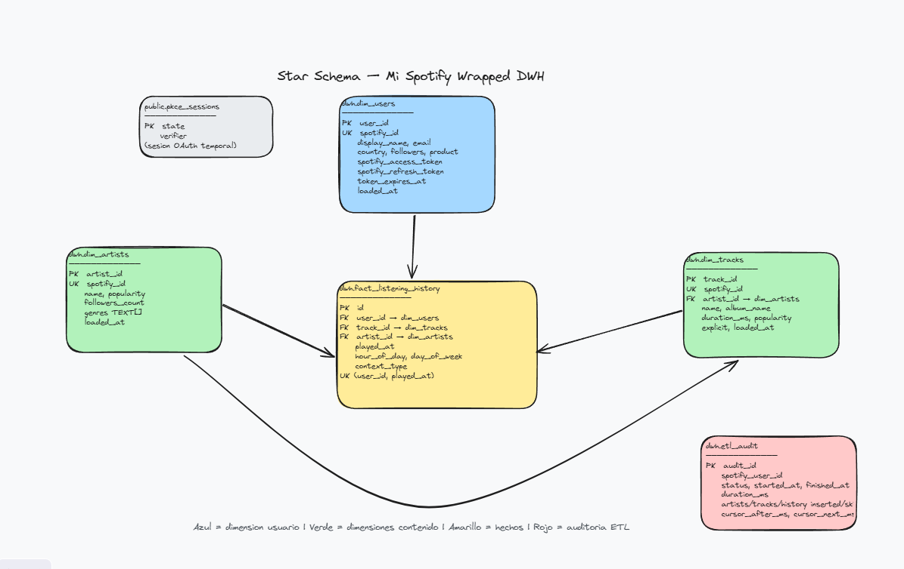
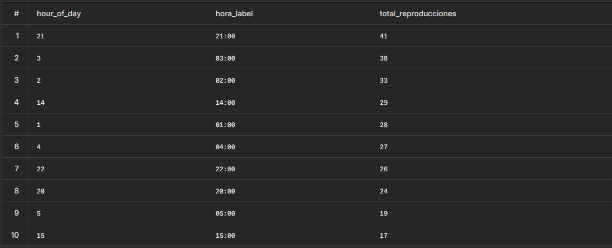
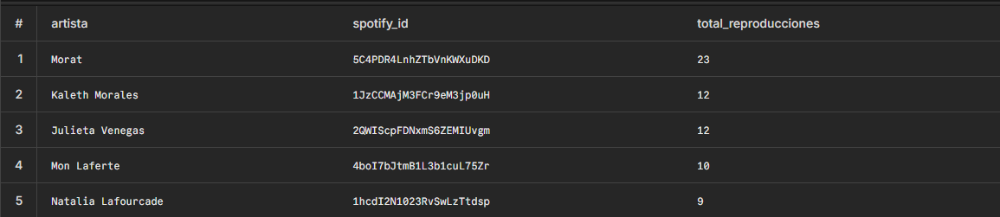
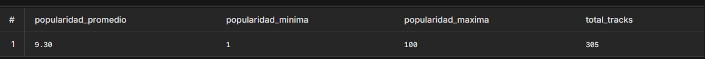
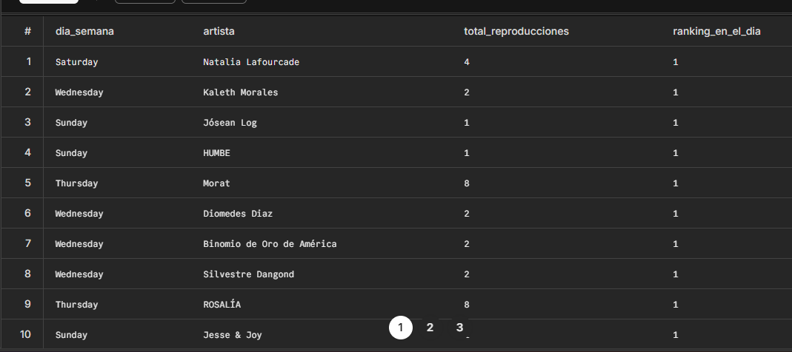

# Analytical Queries and Diagrama del DWH con Excalidraw

## 1. Diagrama del star schema

## Diagrama de Arquitectura

[Ver diagrama en Excalidraw](https://excalidraw.com/#json=...)

### Captura del diagrama

# Preguntas de Diseño — Data Warehouse

## Pregunta 1 

El modelo implementado es un esquema en estrella
La razón es bastante directa: todas las dimensiones del proyecto (dim_users, dim_artists, dim_tracks) se conectan directo a la tabla de hechos fact_listening_history, sin pasar por ninguna tabla intermedia. Son tablas planas, sin subdivisiones ni jerarquías entre ellas.

## Pregunta 2 

 Guardar los géneros como un array de texto dentro de dim_artists no es un error, es una decisión de diseño que tiene sentido en ciertos contextos y no en otros.

## Pregunta 3 

### ¿Qué representa una fila?
Cada fila en fact_listening_history representa una reproducción puntual: un usuario específico escuchando un track específico en un momento específico

### ¿Por qué played_at no puede ser clave primaria por sí sola?

Porque el timestamp no identifica de forma única una reproducción. Dos usuarios distintos perfectamente pueden haber escuchado algo exactamente al mismo segundo, y ambos generarían el mismo valor de played_at. Si ese campo fuera la PK, uno de los dos registros sería rechazado o sobreescribiría al otro, perdiendo datos.

## 2. Consultas SQL analíticas

Las queries completas están en [`analytical_queries.sql`](./analytical_queries.sql).  

---

### Pregunta 1 — Hora del día con más reproducciones

**Resultados:**

**Interpretación:**

mi hora en la que me gusta escuchar mis temas favoritos es a las 9:pm 
---

### Pregunta 2 — Top 5 artistas más escuchados

**Captura (opcional):**

**Interpretación:**

mi artista mas escuchado es morat , lo he escuchado mucho ultimamente. aunque me esperaba un vallenatico 

---

### Pregunta 3 — Popularidad de tus top tracks

**Resultados:**

**Interpretación:**

mis artistas tienen un buen grado de popularidad , eso me solprendio bastante

---

### Pregunta 5 — Ranking de artistas por día de la semana

**Resultados:**

**Interpretación:**

tube un Ranking bastante variado eso es gracias a Dj Livi

---

### Prompt utilizado

no se utilizó

### Técnica de prompting aplicada

no se utilizó
